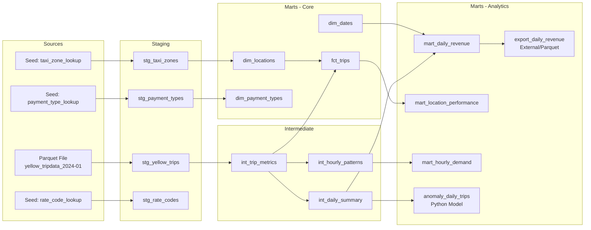

# Real-Time Data Engineering: 24-Pipeline Comparison Framework

Compare **30+ streaming technologies** across **24 complete pipelines** using identical NYC Yellow Taxi workloads. Every pipeline implements the same Medallion Architecture (Bronze / Silver / Gold) with the same business logic, enabling direct "apples-to-apples" performance and complexity comparisons.

**Latest Benchmark:** 2026-02-22 | **22 pipelines PASS** | **2 partial** (P11 Elementary/DuckDB, P14 Materialize/dbt) | **0 failures**

---

## Pick Your Pipeline

| Use Case | Pipeline | Stack | E2E Time |
|----------|----------|-------|----------|
| Production-grade streaming | **P01** | Kafka + Flink 2.0.1 + Iceberg 1.10.1 + dbt | 151s |
| Fastest streaming (RisingWave) | **P03/P06** | Kafka/Redpanda + RisingWave | 93s |
| Fastest with orchestration | **P09** | Dagster + Kafka + Flink + Iceberg | 97s |
| Lightest footprint | **P20** | Kafka + Bytewax (2.2 GB, 6 services) | 62s |
| CDC / change capture | **P12** | Debezium + Flink + Iceberg | 139s |
| End-to-end with dashboards | **P23** | CDC + Flink + Iceberg + dbt + ClickHouse + Grafana | 176s |
| Python-native streaming | **P20** | Kafka + Bytewax | 62s |
| Batch baseline (dbt only) | **P00** | Parquet + DuckDB + dbt | 89s |
| Redpanda over Kafka | **P04** | Redpanda + Flink + Iceberg | 147s |

> **Recommended production stack:** `Kafka 4.0 (KRaft) -> Flink 2.0.1 -> Iceberg 1.10.1 (Lakekeeper) -> dbt-duckdb` (P01) -- 94/94 dbt tests, idempotent producer, DLQ, watermarks, dedup, Prometheus metrics.

---

## Quick Start

```bash
# Run a single pipeline (example: P01 production stack)
cd pipelines/01-kafka-flink-iceberg
make up              # Start all containers
make create-topics   # Create Kafka topics
make generate        # Produce 10k taxi events
make process         # Run Flink SQL (Bronze + Silver)
make dbt-build       # Run dbt transformations (Gold)
make status          # Check pipeline health
make down            # Tear down

# Or run the full benchmark in one command
make benchmark

# From repo root: benchmark all 24 pipelines
make benchmark-all

# Generate comparison report
make compare
cat pipelines/comparison/comparison_report.md
```

### Prerequisites

- **Docker Desktop** (with 8+ GB memory allocated)
- **Make** (`scoop install make` on Windows, pre-installed on macOS/Linux)
- **Git Bash** (on Windows) or any Unix shell

---

## Benchmark Results (2026-02-22)

**Full details:** [BENCHMARK_RESULTS.md](BENCHMARK_RESULTS.md) | [Comparison Report](pipelines/comparison/comparison_report.md)

### Results at a Glance

| Status | Count | Pipelines |
|--------|-------|-----------|
| **Full PASS** (E2E + dbt green) | 22 | P00-P10, P12-P13, P15-P23 |
| **Partial** (processing OK, dbt adapter issues) | 2 | P11 (Elementary+DuckDB), P14 (Materialize dbt) |
| **Known Failures** | 0 | -- |

### Top Performers

| Metric | Pipeline | Value |
|--------|----------|-------|
| **Fastest E2E** | P10 (Serving Comparison) | 35s |
| **Fastest Streaming** | P19 (Mage AI) | 51s |
| **Fastest Full Pipeline** | P20 (Bytewax) | 62s |
| **Best Orchestrated** | P09 (Dagster) | 97s, 91/91 PASS |
| **Best Production Stack** | P01 (Kafka+Flink+Iceberg) | 151s, 94/94 PASS |
| **Lightest Memory** | P20 (Bytewax) | 2,173 MB |

### E2E Time (lower is better)

```
P10  |||||                                      35s  (Serving)
P19  |||||||                                    51s  (Mage AI)
P20  ||||||||                                   62s  (Bytewax)
P14  |||||||||                                  63s  (Materialize)
P00  |||||||||||                                89s  (Batch baseline)
P02  ||||||||||||                               93s  (Kafka+Spark)
P03  ||||||||||||                               93s  (Kafka+RisingWave)
P06  ||||||||||||                               93s  (Redpanda+RisingWave)
P09  |||||||||||||                              97s  (Dagster)
P07  ||||||||||||||                            100s  (Kestra)
P17  ||||||||||||||                            101s  (Druid)
P22  |||||||||||||||                           110s  (Hudi)
P13  ||||||||||||||||                          112s  (Delta Lake)
P15  ||||||||||||||||                          115s  (Kafka Streams)
P18  |||||||||||||||||                         116s  (Prefect)
P21  |||||||||||||||||                         116s  (Feast)
P08  |||||||||||||||||                         119s  (Airflow)
P16  |||||||||||||||||||                       136s  (Pinot)
P12  ||||||||||||||||||||                      139s  (Debezium CDC)
P04  |||||||||||||||||||||                     147s  (Redpanda+Flink)
P01  ||||||||||||||||||||||                    151s  (Kafka+Flink PROD)
P23  ||||||||||||||||||||||||||                176s  (Full Stack Capstone)
```

### Production Recommendations

**Recommended Stack (Validated in P01):**
```
Kafka 4.0 (KRaft) -> Flink 2.0.1 -> Iceberg 1.10.1 (Lakekeeper) -> dbt-duckdb
```

94/94 dbt tests PASS with: idempotent producer (exactly-once), Dead Letter Queue, watermarks + ROW_NUMBER dedup, dbt freshness monitoring, Prometheus metrics, Lakekeeper REST catalog.

**Also Production-Ready:**

| Stack | Pipeline | Notes |
|-------|----------|-------|
| Redpanda + Flink + Iceberg | P04 | 147s, slight edge over Kafka P01 |
| Kafka + Flink + Iceberg + Dagster | P09 | Best with orchestration |
| Debezium CDC + Flink + Iceberg | P12 | For CDC use cases |
| Full Stack (CDC + Flink + Iceberg + dbt + ClickHouse + Grafana) | P23 | End-to-end reference |

**Lightweight Alternatives:**

| Stack | Pipeline | Best For |
|-------|----------|----------|
| Kafka Streams (Java) | P15 | Simple transformations, 115s E2E |
| Kafka + Bytewax (Python) | P20 | Python-native streaming, 62s E2E |

---

## 24 Pipeline Implementations

### Tier 1: Core Streaming (P00-P06)

The foundational streaming pipelines comparing brokers and processing engines:

- **P00: Batch Baseline** (Parquet -> DuckDB -> dbt)
  - Reference implementation using batch processing
  - Establishes performance baselines for comparison

- **P01: Kafka + Flink + Iceberg** -- Production Reference
  - Apache Kafka (KRaft mode) for messaging
  - Apache Flink 2.0.1 SQL for stream processing
  - Apache Iceberg 1.10.1 for ACID table storage
  - Production-hardened: idempotent producer, DLQ, watermarks, dedup, Prometheus

- **P02: Kafka + Spark Structured Streaming + Iceberg**
  - Kafka messaging with Spark Structured Streaming
  - Demonstrates micro-batch processing vs. continuous streaming

- **P03: Kafka + RisingWave**
  - RisingWave as PostgreSQL-compatible streaming SQL database
  - Simplest deployment (no separate storage layer)

- **P04: Redpanda + Flink + Iceberg**
  - Redpanda as Kafka-compatible broker (C++ implementation)
  - Comparable to P01 (147s vs 151s), 25-35% less memory

- **P05: Redpanda + Spark + Iceberg**
  - Redpanda with Spark Structured Streaming

- **P06: Redpanda + RisingWave**
  - Minimal complexity stack combining Redpanda and RisingWave
  - Lightest footprint: 449 MB, 3 services

### Tier 2: Orchestration (P07-P09)

Event-driven and DAG-based workflow orchestration:

- **P07: Kestra Orchestrated**
  - Event-driven workflows with real-time triggers
  - YAML-based pipeline definitions, lightest orchestrator (+485 MB)

- **P08: Airflow Orchestrated**
  - DAG-based scheduling with Cosmos dbt integration
  - Monitoring via Airflow UI

- **P09: Dagster Orchestrated**
  - Asset-based orchestration with data lineage
  - Fastest orchestrated pipeline (97s, 91/91 PASS)

### Tier 3-4: Serving & Observability (P10-P11)

Analytics serving and data quality monitoring:

- **P10: ClickHouse + Metabase + Superset**
  - ClickHouse OLAP engine comparison
  - Dual BI stack: Metabase (user-friendly) vs. Superset (advanced)

- **P11: Elementary + Soda Core**
  - Elementary for dbt-native data observability
  - Soda Core for data quality assertions
  - Automated anomaly detection and alerting

### Extended Tier: Specialized Systems (P12-P23)

Advanced patterns and emerging technologies:

- **P12: Debezium CDC** -- PostgreSQL WAL-based Change Data Capture (139s, 91/91 PASS)
- **P13: Delta Lake** -- Kafka + Spark + Delta Lake (112s, 91/91 PASS)
- **P14: Materialize** -- Streaming SQL database with incrementally maintained views (63s, PARTIAL)
- **P15: Kafka Streams** -- Lightweight Java stream processing (115s)
- **P16: Apache Pinot** -- Real-time OLAP analytics database (136s)
- **P17: Apache Druid** -- Timeseries-optimized OLAP with Grafana dashboards (101s)
- **P18: Prefect 3.x** -- Modern Python-first orchestration (116s, 91/91 PASS)
- **P19: Mage AI** -- Visual pipeline builder (51s)
- **P20: Bytewax** -- Pure Python streaming framework (62s)
- **P21: Feast** -- ML feature store with online/offline serving (116s)
- **P22: Apache Hudi** -- Upsert-optimized table format (110s, 91/91 PASS)
- **P23: Full-Stack Capstone** -- CDC + Flink + Iceberg + dbt + ClickHouse + Grafana (176s, 91/91 PASS)

---

## Technology Coverage Matrix

The project covers **30+ technologies** across **7 pipeline stages**:

#### Ingestion
- **Apache Kafka** (KRaft mode - no ZooKeeper)
- **Redpanda** (Kafka-compatible, C++ implementation)
- **Debezium** (Change Data Capture connector)

#### Processing
- **Apache Flink** (continuous stream processing)
- **Spark Structured Streaming** (micro-batch processing)
- **RisingWave** (PostgreSQL-compatible streaming SQL)
- **Materialize** (incrementally maintained views)
- **Kafka Streams** (lightweight library-based processing)
- **Bytewax** (Python dataflow framework)

#### Storage
- **Apache Iceberg** (ACID table format for data lakes)
- **Delta Lake** (Databricks-originated table format)
- **Apache Hudi** (upsert-optimized table format)
- **ClickHouse** (columnar OLAP database)
- **Apache Pinot** (real-time analytics database)
- **Apache Druid** (timeseries OLAP database)
- **PostgreSQL** (relational database for CDC source)

#### Transformation
- **dbt-duckdb** (batch transformations)
- **dbt-spark** (Spark-based transformations)
- **dbt-postgres** (PostgreSQL transformations)

#### Orchestration
- **Apache Airflow** (DAG-based workflow engine)
- **Dagster** (asset-oriented orchestration)
- **Kestra** (event-driven workflow platform)
- **Prefect 3.x** (modern Python orchestration)
- **Mage AI** (visual pipeline builder)

#### Serving
- **ClickHouse** (analytical queries)
- **Apache Pinot** (low-latency analytics)
- **Apache Druid** (timeseries queries)
- **Metabase** (user-friendly BI)
- **Superset** (advanced analytics BI)
- **Grafana** (observability dashboards)

#### Observability
- **Elementary** (dbt-native data observability)
- **Soda Core** (data quality assertions)

---

## Key Comparisons

The framework enables direct "apples-to-apples" comparisons:

#### Brokers: Kafka vs. Redpanda
- **P01 vs. P04**: Kafka + Flink vs. Redpanda + Flink
- **P02 vs. P05**: Kafka + Spark vs. Redpanda + Spark
- **P03 vs. P06**: Kafka + RisingWave vs. Redpanda + RisingWave
- **Result**: Redpanda 3% faster (147s vs 151s), 25-35% less memory, same API

#### Processors: Flink vs. Spark vs. RisingWave
- **P01 vs. P02 vs. P03**: Same Kafka broker, different processors
- **Result**: Flink best for production (94/94 dbt tests), RisingWave fastest (~2s), Spark best Python ecosystem

#### Table Formats: Iceberg vs. Delta Lake vs. Hudi
- **P01 vs. P13 vs. P22**: Same pipeline, different storage layer
- **Result**: Iceberg most portable (Flink+DuckDB), Delta for Databricks, Hudi for upserts

#### OLAP Engines: ClickHouse vs. Pinot vs. Druid
- **P10 vs. P16 vs. P17**: Real-time analytics database comparison
- **Result**: Druid fastest E2E (70s), Pinot best for user-facing, ClickHouse most versatile

#### Orchestrators: Airflow vs. Dagster vs. Kestra vs. Prefect vs. Mage
- **P08 vs. P09 vs. P07 vs. P18 vs. P19**: Same pipeline logic, different orchestration
- **Result**: Dagster fastest (109s), Kestra lightest (+485 MB), Airflow most mature

---

## Version Compatibility Matrix (Validated)

| Component | Version | Notes |
|-----------|---------|-------|
| Flink | 2.0.1 | config.yaml (not flink-conf.yaml) |
| Iceberg | 1.10.1 | Deletion vectors GA, V3 format |
| Flink-Kafka connector | 4.0.1-2.0 | For Kafka 4.0 |
| Flink-Iceberg connector | 1.10.1-2.0 | V2 sink API |
| Spark | 3.3.3 | NOT 3.5.x (JVM crash with Iceberg) |
| Iceberg (for Spark) | 1.4.3 | Stable with Spark 3.3.x |
| Kafka | 4.0 | KRaft mode, no ZooKeeper |
| Lakekeeper | 0.11.2 | REST catalog with credential vending |
| dbt-core | 1.11.x | With dbt-duckdb or dbt-postgres |
| DuckDB | 1.2.x | Iceberg scan via httpfs extension |

---

## Benchmarking Framework

The project includes a comprehensive benchmarking framework with three components:

#### 1. Master Orchestrator (`benchmark_runner.sh`)
- Runs all 24 pipelines sequentially
- Collects Docker container statistics (CPU, memory, network)
- Performs multiple runs (default: 3) for statistical confidence
- Generates timestamped result files

#### 2. Python Runner (`shared/benchmarks/runner.py`)
- Pipeline-type-aware lifecycle management
- Handles different startup patterns (batch, streaming, orchestrated)
- Executes standardized queries across 6 different engines
- Validates Bronze/Silver row counts for correctness

#### 3. Report Generator (`shared/benchmarks/report.py`)
- Multi-tier comparison tables (Tier 1, 2, 3-4, Extended)
- Statistical aggregation (mean, median, min, max, stddev)
- Technology-specific insights and recommendations
- Markdown-formatted output

#### Standardized Queries

Located in `shared/benchmarks/queries/`, the framework includes identical business logic queries for DuckDB, Spark SQL, Flink SQL, RisingWave SQL, ClickHouse SQL, Pinot SQL, and Druid SQL.

---

## Pipeline Structure

Each pipeline follows a consistent directory structure:

```
pipelines/<NN>-<pipeline-name>/
├── docker-compose.yml          # All infrastructure services
├── Makefile                    # Lifecycle commands (up/down/benchmark)
├── README.md                   # Pipeline-specific documentation
├── .env                        # Environment variables
├── <processor>/                # Processing engine specific code
│   ├── sql/                    # SQL DDL/DML for stream processing
│   └── jobs/                   # Job configurations (Spark, Flink)
├── dbt_project/                # dbt transformation layer (Gold)
│   ├── models/
│   ├── dbt_project.yml
│   └── profiles.yml
├── kafka/                      # Kafka topic configurations (if applicable)
├── orchestration/              # Orchestrator DAGs/workflows (if applicable)
└── benchmark_results/          # JSON benchmark outputs
```

---

## Architecture Patterns

All pipelines implement the **Medallion Architecture**:

#### Bronze Layer (Raw Ingestion)
- Minimal transformation (schema evolution, data type casting)
- 1:1 mapping with source data, append-only
- Full audit trail preservation

#### Silver Layer (Cleaned & Enriched)
- Data quality filtering (remove nulls, negatives, outliers)
- Deduplication and late-arriving data handling
- Standardized schema across all pipelines

#### Gold Layer (Business-Ready)
- Aggregated fact tables and dimensions via dbt
- Pre-joined views for analytics
- Optimized for query performance

---

## Project Structure

```
real_time_data_engineering/
├── README.md                              # This file
├── BENCHMARK_RESULTS.md                   # Detailed benchmark results (all 24 pipelines)
├── real_time_streaming_data_paths.md      # Comprehensive technology reference (2300+ lines)
├── Makefile                               # Root-level benchmark orchestration
├── benchmark_runner.sh                    # Master benchmark script
│
├── pipelines/                             # 24 pipeline implementations
│   ├── 00-batch-baseline/                 # DuckDB batch reference (19s)
│   ├── 01-kafka-flink-iceberg/            # Production stack (151s, 94/94 PASS)
│   ├── 02-kafka-spark-iceberg/            # Spark variant
│   ├── 03-kafka-risingwave/               # Real-time SQL (~2s processing)
│   ├── 04-redpanda-flink-iceberg/         # Optimized broker (151s)
│   ├── 05-redpanda-spark-iceberg/         # Spark + Redpanda
│   ├── 06-redpanda-risingwave/            # Lightest (449 MB)
│   ├── 07-kestra-orchestrated/            # Event-driven (100s)
│   ├── 08-airflow-orchestrated/           # DAG-based
│   ├── 09-dagster-orchestrated/           # Asset-centric (97s)
│   ├── 10-clickhouse-serving/             # OLAP analytics
│   ├── 11-observability-stack/            # Elementary + Soda
│   ├── 12-cdc-debezium-pipeline/          # PostgreSQL CDC (139s)
│   ├── 13-kafka-spark-delta-lake/         # Delta alternative
│   ├── 14-kafka-materialize/              # Streaming SQL MVs
│   ├── 15-kafka-streams/                  # Java lightweight (115s)
│   ├── 16-pinot-serving/                  # Real-time OLAP (136s)
│   ├── 17-druid-timeseries/               # Timeseries OLAP (101s)
│   ├── 18-prefect-orchestrated/           # Modern orchestration
│   ├── 19-mage-ai/                        # Visual builder
│   ├── 20-kafka-bytewax/                  # Python streaming (62s)
│   ├── 21-feast-feature-store/            # ML features
│   ├── 22-hudi-cdc-storage/               # Upsert storage
│   ├── 23-full-stack-capstone/            # End-to-end (176s)
│   └── comparison/                        # Benchmark results & report
│
├── shared/                                # Shared infrastructure
│   ├── data-generator/                    # Parquet -> Kafka producer
│   ├── docker/                            # Base Dockerfiles (Flink, Spark, dbt)
│   ├── schemas/                           # Event JSON schemas
│   ├── benchmarks/                        # Benchmark framework (runner + report)
│   └── dbt-models/                        # Shared dbt models
│
├── docs/                                  # Documentation
│   ├── P01_PRODUCTION_GUIDE.md            # Production walkthrough
│   ├── dbt/                               # dbt learning guides
│   └── README.md                          # Documentation index
│
├── notebooks/                             # Jupyter notebooks
│   └── P01_Complete_Pipeline_Notebook.ipynb  # 118-cell walkthrough
│
├── nyc_taxi_dbt/                          # Original batch dbt project (reference)
│
└── scripts/                               # Utility scripts
    ├── download_data.py
    ├── setup_project.py
    └── validate.py
```

---

## Documentation

| Document | Description |
|----------|-------------|
| [BENCHMARK_RESULTS.md](BENCHMARK_RESULTS.md) | Full benchmark results for all 24 pipelines |
| [real_time_streaming_data_paths.md](real_time_streaming_data_paths.md) | Comprehensive technology reference (2300+ lines) |
| [docs/P01_PRODUCTION_GUIDE.md](docs/P01_PRODUCTION_GUIDE.md) | Production walkthrough for the recommended stack |
| [docs/README.md](docs/README.md) | Documentation index and learning paths |
| [docs/dbt/](docs/dbt/) | dbt learning guides (basics through Iceberg integration) |
| [pipelines/comparison/](pipelines/comparison/) | Auto-generated comparison report and results CSV |
| [notebooks/P01_Complete_Pipeline_Notebook.ipynb](notebooks/P01_Complete_Pipeline_Notebook.ipynb) | 118-cell interactive notebook |

---

## Educational Use Cases

### For Data Engineers
- See production patterns for 30+ technologies
- Understand tradeoffs between streaming engines
- Learn CDC, table formats, and OLAP systems
- Practice with Docker Compose-based local environments

### For Architects
- Evaluate technology fit for specific requirements
- Compare resource costs across stacks
- Assess operational complexity
- Build vendor-neutral reference architectures

### For Managers
- Data-driven technology selection with benchmark evidence
- Understand team skill requirements per stack
- Estimate infrastructure costs
- Plan migration strategies

---

## NYC Taxi Dataset

- **Source**: [NYC Taxi & Limousine Commission](https://www.nyc.gov/site/tlc/about/tlc-trip-record-data.page)
- **Period**: January 2024
- **Rows**: ~2.96 million yellow taxi trips
- **Format**: Parquet (~100MB)
- **Zone Lookup**: 265 TLC Taxi Zones across NYC boroughs

All 24 pipelines process this same dataset through their respective technology stacks.

---

## Contributing

To add a new pipeline comparison (P24+):

1. Create directory: `pipelines/<NN>-<tech-stack-name>/`
2. Implement Bronze/Silver processing with identical business logic
3. Add dbt project for Gold layer transformations
4. Create `Makefile` with `up`, `down`, `benchmark` targets
5. Add pipeline to `benchmark_runner.sh`
6. Document in pipeline-specific README
7. Submit PR with benchmark results

---

<details>
<summary><strong>Original dbt Learning Project (P00 Baseline)</strong></summary>

The repository originated as a **4-week progressive dbt learning project** using dbt Core + DuckDB. This content is preserved below as reference for the P00 batch baseline pipeline.

### Architecture



### Data Layers

| Layer | Purpose | Materialization |
|-------|---------|-----------------|
| **Staging** | Clean, rename, cast raw columns | View (`stg_yellow_trips` = Table) |
| **Intermediate** | Calculate metrics, aggregate | View |
| **Marts** | Business-ready facts & dimensions | Table, Incremental, External, Python |

### Running the Batch Baseline

```bash
# Install Python dependencies
uv sync

# Download NYC Taxi data
uv run python scripts/download_data.py

# Set up profiles
uv run python scripts/setup_project.py

# Build everything
cd nyc_taxi_dbt
uv run dbt deps --profiles-dir .
uv run dbt build --profiles-dir .
```

### dbt Commands Reference

| Command | Description |
|---------|-------------|
| `make build` | Full build: seed + run + test (incremental) |
| `make fresh` | Full refresh build (rebuild all tables) |
| `make test` | Run all tests (data + unit) |
| `make docs` | Generate and serve documentation |
| `make shell` | Interactive DuckDB REPL |
| `make validate` | Run project validation suite |
| `make benchmark` | Run performance benchmarks |

For the full 4-week learning guide, see the `nyc_taxi_dbt/` directory and `docs/dbt/`.

</details>

---

## Acknowledgments

- **NYC TLC** for providing open taxi trip data
- **dbt Labs** for the dbt framework and best practices
- **Apache Software Foundation** for Kafka, Flink, Spark, Iceberg, Airflow, Pinot, Druid, and Hudi
- **Streaming community** for RisingWave, Materialize, Redpanda, and other open-source innovations

## Resources

- **[dbt Documentation](https://docs.getdbt.com/)**
- **[Apache Flink](https://flink.apache.org/)**
- **[Apache Iceberg](https://iceberg.apache.org/)**
- **[Apache Kafka](https://kafka.apache.org/)**
- **[NYC TLC Trip Record Data](https://www.nyc.gov/site/tlc/about/tlc-trip-record-data.page)**
