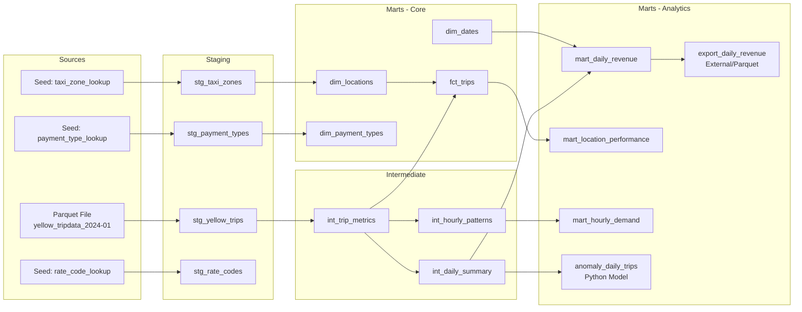

# dbt Master -- NYC Taxi Trip Analytics

A **4-week progressive dbt learning project** using **dbt Core + DuckDB** with **NYC Yellow Taxi trip data**. Managed with `uv` and `pyproject.toml` for a modern Python workflow.

## Architecture



**Data flows through 3 layers:**

| Layer | Purpose | Materialization |
|-------|---------|-----------------|
| **Staging** | Clean, rename, cast raw columns | View (`stg_yellow_trips` = Table) |
| **Intermediate** | Calculate metrics, aggregate | View |
| **Marts** | Business-ready facts & dimensions | Table, Incremental, External, Python |

---

## Prerequisites

- **Python 3.10+**
- **[uv](https://docs.astral.sh/uv/getting-started/installation/)** -- fast Python package manager
- **Git**

---

## Quick Start

```bash
# 1. Clone the repo
git clone https://github.com/ghadfield32/dbt_master.git
cd dbt_master

# 2. Install Python dependencies
uv sync

# 3. Download NYC Taxi data (~100MB parquet + zone lookup CSV)
uv run python scripts/download_data.py

# 4. Set up local profiles.yml
uv run python scripts/setup_project.py

# 5. Build everything (seeds + models + tests)
cd nyc_taxi_dbt
uv run dbt deps --profiles-dir .
uv run dbt build --profiles-dir .
```

---

## Project Structure

```
dbt_master/
├── pyproject.toml                         # Python deps (dbt-core, dbt-duckdb, etc.)
├── Makefile                               # Make targets wrapping dbt commands
├── .sqlfluff                              # SQLFluff linter config (DuckDB dialect)
├── .gitignore
├── README.md                              # This file
│
├── .github/workflows/
│   └── dbt-ci.yml                         # GitHub Actions CI pipeline
│
├── scripts/
│   ├── download_data.py                   # Download parquet + zone CSV
│   ├── verify_data.py                     # Quick DuckDB inspection
│   ├── setup_project.py                   # Copy profiles.yml.example -> profiles.yml
│   ├── shell.py                           # Interactive DuckDB REPL
│   ├── validate.py                        # Project validation suite
│   └── benchmark.py                       # Performance benchmarking
│
├── data/                                  # Raw data (gitignored)
│   └── yellow_tripdata_2024-01.parquet
│
├── exports/                               # External materialization output (gitignored)
│   └── daily_revenue.parquet              # Parquet export of mart_daily_revenue
│
├── nyc_taxi_dbt/                          # dbt project root
│   ├── dbt_project.yml                    # Project config
│   ├── packages.yml                       # dbt packages (dbt_utils, codegen)
│   ├── profiles.yml.example               # Connection template (committed)
│   ├── profiles.yml                       # Your local connection (gitignored)
│   │
│   ├── seeds/                             # Small reference CSVs
│   │   ├── taxi_zone_lookup.csv           # ~265 zones
│   │   ├── payment_type_lookup.csv        # 6 payment types
│   │   ├── rate_code_lookup.csv           # 7 rate codes
│   │   └── seed_properties.yml
│   │
│   ├── models/
│   │   ├── sources.yml                    # External source + freshness config
│   │   ├── exposures.yml                  # Downstream consumers (dashboards)
│   │   ├── example/                       # Week 1 starter models
│   │   ├── staging/                       # Clean + rename raw data
│   │   │   └── _unit_tests.yml            # Unit tests for stg_yellow_trips
│   │   ├── intermediate/                  # Calculate metrics + aggregate
│   │   │   └── _unit_tests.yml            # Unit tests for int_trip_metrics
│   │   └── marts/                         # Business-ready tables
│   │       ├── core/                      # Fact + dimension tables (with contracts)
│   │       │   └── _unit_tests.yml        # Unit tests for fct_trips
│   │       └── analytics/                 # Pre-aggregated analytics (with contracts)
│   │           ├── anomaly_daily_trips.py # Python model: anomaly detection
│   │           └── export_daily_revenue.sql # External materialization (parquet)
│   │
│   ├── macros/                            # Reusable SQL functions
│   ├── tests/                             # Singular (custom) tests
│   ├── analyses/                          # Ad-hoc queries (not materialized)
│   └── snapshots/
│       └── snap_locations.sql             # SCD Type 2 snapshot for taxi zones
│
└── docs/                                  # Learning notes per week
```

---

## Week-by-Week Learning Guide

### Week 1: Getting Started

**What you will learn:** uv, pyproject.toml, dbt init, profiles.yml, `dbt debug`, `dbt run`, materializations (view vs table), the `ref()` function.

#### Steps

```bash
# 1. Create the Python environment
cd dbt_master
uv sync

# 2. Set up local profiles
uv run python scripts/setup_project.py

# 3. Verify dbt can connect to DuckDB
cd nyc_taxi_dbt
uv run dbt debug --profiles-dir .
# Should show: "All checks passed!"

# 4. Run the example models
uv run dbt run --profiles-dir .
# Creates my_first_model and my_second_model in DuckDB

# 5. Explore what dbt created
cd ..
uv run python -c "
import duckdb
con = duckdb.connect('dev.duckdb')
print(con.sql('SHOW ALL TABLES').fetchdf().to_string())
con.close()
"
```

#### Key Concepts

- **pyproject.toml**: Declares project dependencies. `uv sync` installs them into a virtual environment.
- **profiles.yml**: Tells dbt HOW to connect (which database, where). Ours points to a local DuckDB file.
- **dbt_project.yml**: Tells dbt WHAT the project is (name, paths, materializations).
- **ref()**: The `{{ ref('model_name') }}` function creates dependencies between models. dbt builds them in the right order automatically.
- **Materializations**: `view` = SQL view (fast to create, queries run each time). `table` = physical table (slower to create, faster to query).

#### Exercises

1. Change `my_first_model` to materialize as a `table` (add `{{ config(materialized='table') }}` at the top). Run `dbt run` and check the DuckDB file size difference.
2. Add a third model that references `my_second_model` and adds a new calculated column.
3. Run `dbt run --select my_second_model+` (the `+` means "and everything downstream").

---

### Week 2: Seeds, Staging, and Real Data

**What you will learn:** `dbt seed`, reading parquet files, the staging pattern (clean/rename/cast), CTEs, `ref()` chaining, basic data quality filtering.

#### Steps

```bash
# 1. Download NYC Taxi data
cd dbt_master
uv run python scripts/download_data.py

# 2. Verify the data
uv run python scripts/verify_data.py
# Should show ~3M rows and column schema

# 3. Load seed CSV files into DuckDB
cd nyc_taxi_dbt
uv run dbt seed --profiles-dir .

# 4. Run staging models
uv run dbt run --select staging --profiles-dir .

# 5. Check results
cd ..
uv run python -c "
import duckdb
con = duckdb.connect('dev.duckdb')
print('=== Trip count ===')
print(con.sql('SELECT count(*) FROM main_staging.stg_yellow_trips').fetchone())
print('=== Zones ===')
print(con.sql('SELECT count(*) FROM main_staging.stg_taxi_zones').fetchone())
con.close()
"
```

#### Key Concepts

- **Seeds**: Small CSV files that dbt loads directly into the database. Perfect for reference/lookup tables (zones, payment types, rate codes). NOT for large datasets.
- **Staging models**: The first transformation layer. Their job is simple: rename columns to snake_case, cast types, filter obviously bad records. One staging model per source.
- **CTEs (Common Table Expressions)**: The `with ... as (...)` pattern keeps SQL readable. Each CTE is a logical step: source -> renamed -> filtered.
- **DuckDB + Parquet**: DuckDB reads parquet files natively with `read_parquet()`. No ETL needed!

#### Exercises

1. Query the staging model to find: How many distinct pickup locations exist? What's the average fare?
2. Add a filter to `stg_yellow_trips` that removes trips with `passenger_count = 0`. Re-run and compare row counts.
3. Create a simple model that counts trips per borough by joining `stg_yellow_trips` with `stg_taxi_zones`.

---

### Week 3: Packages, Documentation, and Testing

**What you will learn:** dbt packages (dbt_utils, codegen), surrogate keys, YAML schema files, column descriptions, generic tests (not_null, unique, accepted_values, relationships), singular tests, custom generic tests, `dbt test`, `dbt build`.

#### Steps

```bash
cd nyc_taxi_dbt

# 1. Install dbt packages
uv run dbt deps --profiles-dir .

# 2. (Optional) Use codegen to generate YAML skeletons
uv run dbt run-operation generate_model_yaml --args "{'model_names': ['stg_yellow_trips']}" --profiles-dir .
# Copy the output into staging.yml and add descriptions

# 3. Run all models (staging + intermediate)
uv run dbt run --profiles-dir .

# 4. Run all tests
uv run dbt test --profiles-dir .

# 5. Or run everything in dependency order
uv run dbt build --profiles-dir .
```

#### Key Concepts

- **Packages**: Reusable dbt code from the community. `dbt_utils` provides `generate_surrogate_key`, `date_spine`, `accepted_range` test, and more. `codegen` auto-generates YAML schema files from your models.
- **surrogate_key**: `dbt_utils.generate_surrogate_key()` creates a deterministic hash from multiple columns. Useful when the source data lacks a true primary key (like taxi trips).
- **Schema YAML (`.yml`)**: Defines metadata for your models -- descriptions, column docs, and tests. Lives alongside your SQL files.
- **Generic tests**: Built-in tests you declare in YAML: `not_null`, `unique`, `accepted_values`, `relationships` (foreign key check).
- **Singular tests**: Custom SQL files in `tests/` that return failing rows. If 0 rows returned, the test passes.
- **Custom generic tests**: Reusable test macros in `macros/`. Our `positive_value` test checks that a column has no negative values.
- **Test severity**: Use `config: {severity: warn}` for tests on real-world data that may have known quality issues. Warns instead of failing the build.

#### Test Strategy

| Test Type | What It Checks | Example |
|-----------|---------------|---------|
| `not_null` | No nulls in column | `trip_id`, `pickup_datetime` |
| `unique` | No duplicate values | `dim_locations.location_id` |
| `accepted_values` | Values within allowed set | `vendor_id` in [1, 2] |
| `relationships` | Foreign key exists in target | `pickup_location_id` -> `stg_taxi_zones` |
| `dbt_utils.accepted_range` | Value within numeric range | `trip_duration_minutes` between 1-720 |
| Singular test | Custom SQL assertion | `assert_trip_duration_positive` |
| Custom generic | Reusable custom test | `positive_value` on `fare_amount` |

#### Exercises

1. Run `dbt test --select stg_yellow_trips` and observe which tests pass/warn/fail. Investigate the failures.
2. Add a `dbt_utils.unique_combination_of_columns` test on `int_hourly_patterns` for `(pickup_date, pickup_hour, is_weekend)`.
3. Write a singular test that checks for trips where `dropoff_datetime < pickup_datetime`.

---

### Week 4: Sources, Marts, and Documentation

**What you will learn:** `source()`, external sources in dbt-duckdb, dimensional modeling (fact tables + dimensions), the staging/intermediate/marts layering pattern, `dbt docs generate`, `dbt docs serve`, DAG visualization.

#### Steps

```bash
cd nyc_taxi_dbt

# 1. Build everything end-to-end
uv run dbt build --profiles-dir .

# 2. Generate documentation site
uv run dbt docs generate --profiles-dir .

# 3. Serve docs locally (opens in browser)
uv run dbt docs serve --profiles-dir .
# Visit http://localhost:8080 -- explore the DAG!

# 4. Run just the marts
uv run dbt run --select marts --profiles-dir .

# 5. Run a model and all its upstream dependencies
uv run dbt run --select +mart_daily_revenue --profiles-dir .

# 6. Test just the marts
uv run dbt test --select marts --profiles-dir .
```

#### Key Concepts

- **source()**: `{{ source('raw_nyc_taxi', 'raw_yellow_trips') }}` references data that exists OUTSIDE dbt (our parquet file). Defined in `sources.yml`. Enables lineage tracking from raw data through all transformations.
- **External sources (dbt-duckdb)**: The `config.external_location` in `sources.yml` tells dbt-duckdb to use `read_parquet()` to load the data. No pre-loading needed!
- **Dimensional modeling**: Organize your data into **fact tables** (events/transactions with metrics) and **dimension tables** (descriptive attributes for filtering/grouping).
  - `fct_trips`: One row per trip with all measures (fare, distance, duration, etc.)
  - `dim_locations`: Zone ID -> borough, zone name
  - `dim_dates`: Date -> day of week, weekend flag, holiday flag
  - `dim_payment_types`: Payment ID -> name
- **Analytics marts**: Pre-aggregated tables for common business questions. Faster to query than the fact table.
- **dbt docs**: Generates a searchable website from your YAML descriptions, showing the full DAG (dependency graph). Essential for team communication.

#### The 3-Layer Pattern

```
Raw Data  -->  Staging  -->  Intermediate  -->  Marts
(parquet)     (clean)       (enrich)          (serve)

Source:        stg_*         int_*            fct_* / dim_* / mart_*
- rename       - calc fields   - join dims
- cast types   - aggregate     - aggregate
- filter bad   - filter        - window funcs
```

#### Exercises

1. Open the dbt docs site and trace the lineage from `raw_yellow_trips` through to `mart_daily_revenue`. How many models does data pass through?
2. Add a new dimension: `dim_rate_codes` (from `stg_rate_codes`). Join it into `fct_trips` to add `rate_code_name`.
3. Create a new analytics mart: `mart_borough_comparison` that compares metrics across boroughs (total trips, avg fare, avg tip %).
4. Add source freshness checks to `sources.yml` using `loaded_at_field`.

---

### Beyond Week 4: Modern dbt Features

After mastering the 4-week fundamentals, the project also demonstrates these advanced dbt capabilities:

#### Unit Tests (dbt 1.8+)

Native unit tests validate transformation logic with mock data -- no real database needed. See `_unit_tests.yml` files in each model directory.

```bash
# Run only unit tests
uv run dbt test --select "test_type:unit" --profiles-dir .
```

**7 unit tests cover:**
- `stg_yellow_trips`: Column renaming, null/negative/date filtering
- `int_trip_metrics`: Duration, speed, weekend flag, impossible trip filtering, zero-division safety
- `fct_trips`: Left join enrichment preserving unknown locations

#### Model Contracts

All 7 mart models enforce contracts (`contract: { enforced: true }`) that guarantee column names and data types. If the model's output doesn't match the contract, the build fails.

#### Incremental Materialization

`fct_trips` uses `incremental` materialization with `delete+insert` strategy. On subsequent runs, only new trips (by `pickup_datetime`) are processed -- reducing build time from ~4s to ~0.2s.

```bash
# Normal run (incremental)
uv run dbt run --select fct_trips --profiles-dir .

# Full rebuild
uv run dbt run --select fct_trips --full-refresh --profiles-dir .
```

#### Snapshots (SCD Type 2)

`snap_locations` tracks changes to taxi zone definitions using dbt's `check` strategy. Creates `dbt_valid_from` / `dbt_valid_to` columns for historical tracking.

```bash
uv run dbt snapshot --profiles-dir .
```

#### Exposures

`exposures.yml` documents downstream consumers (dashboards, reports) that depend on mart models. Visible in the DAG documentation site.

#### Source Freshness

`sources.yml` includes `freshness` config with `loaded_at_field`. Check data currency with:

```bash
uv run dbt source freshness --profiles-dir .
```

#### CI/CD

`.github/workflows/dbt-ci.yml` provides a GitHub Actions pipeline that runs the full build on every PR.

#### External Materialization (Parquet Export)

`export_daily_revenue` uses dbt-duckdb's `external` materialization to write data directly to a parquet file at `exports/daily_revenue.parquet`. A view is created in DuckDB that reads from the file, keeping it in the DAG. Use this to share data with external tools (Jupyter, Polars, Spark) without DuckDB access.

```bash
# Build the export
uv run dbt run --select export_daily_revenue --profiles-dir .

# Read the parquet with any tool
uv run python -c "import duckdb; print(duckdb.query('SELECT * FROM read_parquet(\"exports/daily_revenue.parquet\") LIMIT 5').df())"
```

#### Python Models (Anomaly Detection)

`anomaly_daily_trips` is a native dbt Python model that uses pandas for statistical anomaly detection. It applies both z-score and IQR methods to flag unusual days in trip volumes and revenue. Demonstrates how to combine SQL-based dbt pipelines with Python-based ML/analytics.

```bash
# Run the Python model
uv run dbt run --select anomaly_daily_trips --profiles-dir .

# View flagged anomalies
make shell
# dbt> SELECT * FROM main_marts.anomaly_daily_trips WHERE is_anomaly
```

#### Interactive Shell & Scripts

```bash
make shell        # Interactive DuckDB REPL connected to dev database
make validate     # Run project validation suite (idempotency, contracts, etc.)
make benchmark    # Run performance benchmarks
```

---

## Data Dictionary

### Staging Models

| Model | Description | Row Grain |
|-------|-------------|-----------|
| `stg_yellow_trips` | Cleaned taxi trip records | One per trip |
| `stg_taxi_zones` | Zone ID to borough/name mapping | One per zone (~265) |
| `stg_payment_types` | Payment type codes | One per type (6) |
| `stg_rate_codes` | Rate code definitions | One per code (7) |

### Intermediate Models

| Model | Description | Row Grain |
|-------|-------------|-----------|
| `int_trip_metrics` | Trips enriched with duration, speed, tip %, time dims | One per valid trip |
| `int_daily_summary` | Daily aggregated metrics | One per day |
| `int_hourly_patterns` | Hourly aggregated metrics | One per date + hour |

### Mart Models (Core)

| Model | Description | Row Grain |
|-------|-------------|-----------|
| `fct_trips` | Fact table with location names joined | One per valid trip |
| `dim_locations` | Location dimension | One per zone |
| `dim_dates` | Date dimension (Jan 2024) | One per day |
| `dim_payment_types` | Payment type dimension | One per type |

### Mart Models (Analytics)

| Model | Description | Row Grain |
|-------|-------------|-----------|
| `mart_daily_revenue` | Daily revenue with running totals | One per day |
| `mart_location_performance` | Per-zone performance summary | One per zone |
| `mart_hourly_demand` | Hourly demand patterns | One per hour + weekday/weekend |
| `export_daily_revenue` | Parquet export of daily revenue (external) | One per day |
| `anomaly_daily_trips` | Anomaly detection on daily metrics (Python) | One per day |

---

## NYC Taxi Dataset

- **Source**: [NYC Taxi & Limousine Commission](https://www.nyc.gov/site/tlc/about/tlc-trip-record-data.page)
- **Period**: January 2024
- **Rows**: ~3 million yellow taxi trips
- **Format**: Parquet (~100MB)
- **Zone Lookup**: 265 TLC Taxi Zones across NYC boroughs

### Key Columns

| Column | Description |
|--------|-------------|
| `VendorID` | 1=Creative Mobile, 2=VeriFone |
| `tpep_pickup_datetime` | Meter engaged timestamp |
| `tpep_dropoff_datetime` | Meter disengaged timestamp |
| `passenger_count` | Number of passengers (driver-entered) |
| `trip_distance` | Trip distance in miles (taximeter) |
| `PULocationID` / `DOLocationID` | Pickup/dropoff TLC Zone IDs |
| `payment_type` | 1=Credit, 2=Cash, 3=No charge, 4=Dispute |
| `fare_amount` | Time-and-distance fare |
| `tip_amount` | Tip (auto for credit card; cash tips not recorded) |
| `total_amount` | Total charged (excludes cash tips) |

### Known Data Quality Issues

- **Null `passenger_count`**: Some trips have null or 0 passengers. These are retained but flagged.
- **Unknown location IDs**: IDs 264/265 appear in trip data but not in the zone lookup. The `relationships` test uses `severity: warn` for this.
- **Negative fares**: Some records have negative `fare_amount` (adjustments/corrections). Filtered in staging.
- **Zero-distance trips**: Some trips show 0 distance with non-zero fares (flat-rate, airport, etc.). Retained.

---

## Commands Reference

### Using Make (recommended)

A `Makefile` wraps all common commands. Run from the repo root:

| Command | Description |
|---------|-------------|
| `make build` | Full build: seed + run + test (incremental) |
| `make fresh` | Full refresh build (rebuild all tables) |
| `make test` | Run all tests (data + unit) |
| `make test-unit` | Run only unit tests |
| `make docs` | Generate and serve documentation |
| `make debug` | Check dbt connection |
| `make lint` | Lint SQL with SQLFluff |
| `make snapshot` | Run SCD Type 2 snapshots |
| `make shell` | Interactive DuckDB REPL |
| `make validate` | Run project validation suite |
| `make benchmark` | Run performance benchmarks |
| `make setup` | Initial project setup |
| `make help` | Show all available targets |

### Raw dbt Commands

All commands assume you're in the `nyc_taxi_dbt/` directory.

| Command | Description |
|---------|-------------|
| `uv run dbt debug --profiles-dir .` | Verify connection and config |
| `uv run dbt seed --profiles-dir .` | Load CSV seeds into DuckDB |
| `uv run dbt run --profiles-dir .` | Run all models |
| `uv run dbt run --select staging --profiles-dir .` | Run only staging models |
| `uv run dbt run --select +fct_trips --profiles-dir .` | Run fct_trips and all upstream |
| `uv run dbt test --profiles-dir .` | Run all tests (data + unit) |
| `uv run dbt test --select "test_type:unit" --profiles-dir .` | Run only unit tests |
| `uv run dbt build --profiles-dir .` | Seed + run + test in dependency order |
| `uv run dbt build --full-refresh --profiles-dir .` | Rebuild all tables from scratch |
| `uv run dbt snapshot --profiles-dir .` | Run SCD Type 2 snapshots |
| `uv run dbt source freshness --profiles-dir .` | Check source data freshness |
| `uv run dbt deps --profiles-dir .` | Install packages from packages.yml |
| `uv run dbt docs generate --profiles-dir .` | Generate documentation site |
| `uv run dbt docs serve --profiles-dir .` | Serve docs at localhost:8080 |
| `uv run dbt clean --profiles-dir .` | Delete target/ and dbt_packages/ |

**Tip**: Set the environment variable once to skip `--profiles-dir .`:

```powershell
# PowerShell
$env:DBT_PROFILES_DIR = "."

# cmd
set DBT_PROFILES_DIR=.

# bash/zsh
export DBT_PROFILES_DIR=.
```

---

## Troubleshooting

### `dbt debug` fails with "Could not find profile"

The `profiles.yml` file is missing or in the wrong location. Run:
```bash
uv run python scripts/setup_project.py
```
Or copy `profiles.yml.example` to `profiles.yml` manually.

### DuckDB file lock error

DuckDB allows only one write connection. Close any other tool that has `dev.duckdb` open (Python REPL, DBeaver, etc.). If a `.wal` file lingers after a crash:
```bash
del dev.duckdb.wal   # Windows
rm dev.duckdb.wal    # macOS/Linux
```

### `accepted_values` test fails on `payment_type_id`

The real dataset may contain values outside our expected set (e.g., 0 for unknown). Check which values exist:
```sql
-- In DuckDB
SELECT DISTINCT payment_type FROM read_parquet('data/yellow_tripdata_2024-01.parquet');
```
Then update the `accepted_values` list in `staging.yml` or change severity to `warn`.

### `relationships` test warns for location IDs

Location IDs 264/265 appear in trip data but not in the taxi zone lookup. This is expected -- they represent "Unknown" zones. The test is configured with `severity: warn`.

### Models fail with "read_parquet: No such file"

The parquet file path is relative to the DuckDB database file location (`dev.duckdb` at repo root). Make sure:
1. You downloaded the data: `uv run python scripts/download_data.py`
2. The `dev.duckdb` file is at the repo root (not inside `nyc_taxi_dbt/`)
3. Paths in `sources.yml` use forward slashes (even on Windows)

---

## Resources

- [dbt Documentation](https://docs.getdbt.com/)
- [dbt Best Practices: How We Structure Projects](https://docs.getdbt.com/best-practices/how-we-structure/1-guide-overview)
- [dbt-duckdb Adapter](https://github.com/duckdb/dbt-duckdb)
- [DuckDB Documentation](https://duckdb.org/docs/)
- [NYC TLC Trip Record Data](https://www.nyc.gov/site/tlc/about/tlc-trip-record-data.page)
- [NYC TLC Data Dictionary](https://www.nyc.gov/assets/tlc/downloads/pdf/data_dictionary_trip_records_yellow.pdf)
- [dbt_utils Package](https://hub.getdbt.com/dbt-labs/dbt_utils/latest/)
- [codegen Package](https://hub.getdbt.com/dbt-labs/codegen/latest/)
- [uv Documentation](https://docs.astral.sh/uv/)
